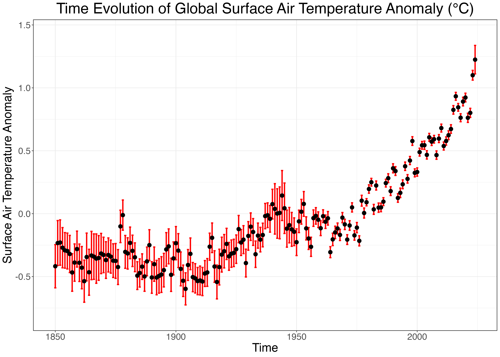

# Global Surface Temperature Anomaly
---

 

Reference/Data Source:
Morice, C. P., J. J. Kennedy, N. A. Rayner, and P. D. Jones (2012), Quantifying uncertainties in global and regional temperature change using an ensemble of observational estimates: The HadCRUT4 dataset, J. Geophys. Res., 117, D08101, doi:10.1029/2011JD017187.
